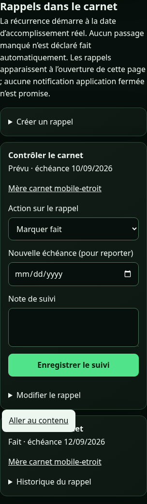
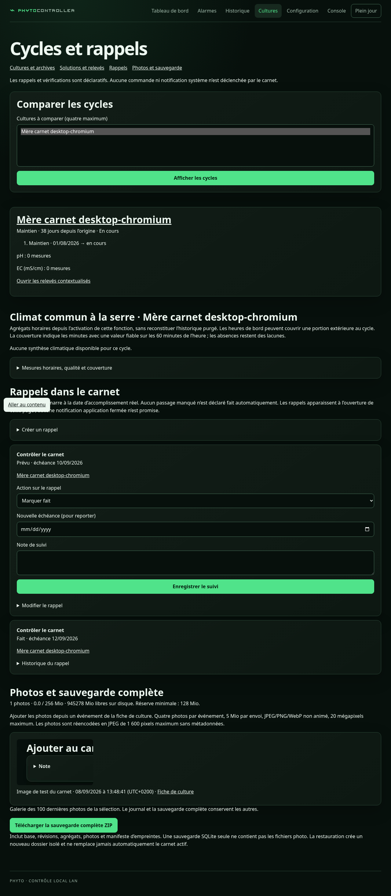

# Carnet de cultures — guide d'exploitation

Le menu **Cultures** ouvre `/cultures`. Sur téléphone, il se trouve dans **Plus** ; le tableau
de bord comporte aussi un résumé des deux espaces et un accès au carnet.

Le carnet conserve les données sans purge automatique, indépendamment de l'historique technique
de 72 h. Ses actions ne changent ni horaires, ni pompe, ni ventilation. Les réglages continuent
de se faire dans **Configuration**.

Sept pages composent le carnet, toutes déclaratives :

| Page | À quoi elle sert |
| --- | --- |
| **Cultures** (`/cultures`) | Mères, lots, parcours, journal d'une fiche |
| **Solutions, relevés et arrosages** (`/cultures/solutions`) | Routine pH/EC, interventions, recettes, courbes |
| **Cycles et rappels** (`/cultures/cycles`) | Comparaison, climat, vérifications, rappels, photos, sauvegarde |
| **Plages cibles** (`/cultures/targets`) | Plages pH/EC de référence, facultatives et datées |
| **Repères d'éclairage** (`/cultures/light`) | Repère déclaré face aux horaires réellement configurés |
| **Équipements** (`/cultures/equipment`) | Quel équipement servait à quoi, et quand |
| **Journal** (`/cultures/journal`) | Chronologie transversale et observations d'espace |

## La journée type

Depuis le lot UI 2, le carnet s'ouvre sur ce qu'il y a à faire, pas sur une rubrique technique.
Rien n'y change : ces parcours restent **déclaratifs**. Aucun bouton du carnet ne commande une
pompe, une ventilation ou un éclairage, aucun rappel n'envoie de notification, et hors ligne aucune
saisie n'est mise en attente ni rejouée — le formulaire garde la saisie à l'écran et le dit.

### L'accueil « Aujourd'hui »

`/cultures` commence par un bloc daté du jour, dans le fuseau du carnet :

1. **Les rappels classés** : *En retard*, *Aujourd'hui*, *Terminés aujourd'hui*, puis un simple
   décompte « n à venir » qui renvoie aux cycles. Les rappels en retard et du jour sont
   **actionnables sur place** : « Marquer fait », « Reporter » ou « Annuler », avec une note de
   suivi, sans ouvrir `/cultures/cycles`. Après enregistrement, la page revient sur la carte du
   rappel, qui reçoit le focus et affiche « Rappel mis à jour ».
   Le champ « Nouvelle échéance » ne concerne que « Reporter » : il n'apparaît qu'au choix de cette
   action. Sans JavaScript, il reste visible en permanence — rien n'est perdu.
   Un carnet sans aucun rappel propose de créer le premier.
2. **Trois raccourcis** — saisir un relevé, noter une observation, créer une culture. Le raccourci
   d'observation mène directement à la fiche lorsqu'une seule culture est suivie, sinon à la liste.
   Ils viennent **après** les rappels : sur un téléphone de 393 px de large, trois boutons empilés
   repoussaient la première carte de rappel hors de l'écran, et l'accueil montrait ce qu'on peut
   faire avant ce qui est dû. Les liens de rubrique (« Cultures actives », « Archives », « Réglages
   des équipements ») passent pour la même raison sous l'agenda, l'en-tête ne gardant que le titre
   et sa ligne de présentation. Ils restent dans l'en-tête d'une fiche.
3. **Les dernières opérations** : au plus cinq entrées du journal transversal, un lien par entrée,
   suivies de « Voir tout le journal » lorsqu'il y en a davantage.

Vient ensuite l'occupation des deux espaces, puis la liste des cultures. Un **filtre local** au-dessus
de cette liste masque les cartes qui ne correspondent pas au nom ou à la variété saisis : il ne
déclenche aucune requête, ne travaille que sur la page affichée, et n'apparaît pas si le script
n'est pas exécuté. Un carnet vide affiche « Le carnet est vide » et un bouton « Ajouter ma première
culture ». Les archives (`/cultures?archives=1`) sont titrées « Archives » et n'ont **pas** de bloc
« Aujourd'hui » : une archive n'a ni rappel ni prochaine action.

### La fiche d'une culture

La fiche s'ouvre sur un en-tête permanent — nom, variété, stade et J{n}, espace et état, effectif
restant — puis sur « Que faire maintenant ? » :

- **Relevé** : ouvre la saisie de relevé déjà filtrée sur cette culture.
- **Observation / photo** : une note, sa date, et une photo facultative.
- **Une seule action de parcours**, celle que l'état rend évidente : passer au stade suivant,
  déplacer, récolter et lancer le séchage, clore le séchage, archiver le pied mère ou libérer
  l'espace. Les autres opérations existent toujours, repliées sous « Autres opérations ».

Une barre de liens locaux — Synthèse · Journal · Relevés · Photos · Bilan — déplace dans la page
sans la recharger. « Relevés » rappelle le dernier relevé rattaché ; « Photos » regroupe les images
de la fiche, chacune renvoyant à l'entrée du journal qui la porte ; « Bilan » indique explicitement
qu'il n'existe pas encore avant la fin du séchage. Dans le journal, chaque entrée montre l'essentiel
en clair et replie sa **traçabilité** (identifiant, version, date de saisie, fiabilité de l'horloge,
contexte d'équipements, motif) ainsi que ses corrections et versions précédentes.

Après un enregistrement, la page revient **sur l'entrée créée** : elle reçoit le focus, ses replis
sont ouverts et elle affiche « Entrée ajoutée ». C'est la confirmation ; il n'y en a pas d'autre.

### Observation et photo en une fois

Le formulaire « Observation / photo » enregistre d'abord la note, puis la photo, en deux envois
successifs. Un aperçu local de l'image est affiché avant tout envoi.

Si la photo est refusée alors que la note est passée, le message le dit sans ambiguïté :
« L'observation est enregistrée ; la photo n'a pas été acceptée ». Les champs de l'observation sont
alors verrouillés et le bouton devient **« Réessayer la photo »** : seule la photo repart, la note
n'est jamais réenregistrée ni dupliquée. Choisir une autre image ou recharger la fiche sont les
deux issues possibles. Une photo de plus de 5 Mio est refusée avant même l'envoi.

**Sauf pour un conflit de version.** Si la fiche a changé entre l'observation et la photo, la
révision mémorisée sur le formulaire est périmée : la rejouer ne pourrait donner qu'un second refus.
Le message devient alors « L'observation est enregistrée ; la fiche a changé entre-temps :
rechargez-la puis ajoutez la photo depuis l'entrée. », et le bouton est remplacé par un lien
**« Recharger la fiche »** qui mène à l'entrée déjà écrite.

Une photo peut aussi être ajoutée après coup à n'importe quelle entrée non annulée, depuis son
repli « Ajouter une photo à cette entrée ».

### Dire ce que l'on vient faire sur les solutions

`/cultures/solutions` propose en tête quatre intentions : **Mesurer pH / EC**, **Arroser**,
**Renouveler la solution**, **Ajouter de l'eau**. Choisir l'une d'elles conserve la cible et la
période déjà filtrées, présélectionne le type dans la saisie et ouvre celle-ci ; l'intention active
est marquée visuellement. Les deux types restants (ajout de nutriments, correction pH) demeurent
dans le choix « Action » du formulaire. Une **correction** d'entrée existante ignore l'intention
courante : elle reste sur le type de l'entrée d'origine. Les mesures ne sont jamais préremplies.
Comme sur la fiche, l'enregistrement ramène sur l'entrée créée.

### Un refus se lit à côté du champ

Un enregistrement refusé n'affiche plus un message isolé en bas de formulaire. Le formulaire porte
désormais un **résumé** en tête (« La saisie n'a pas été enregistrée. ») dont chaque ligne est un
lien vers le champ concerné ; le champ lui-même est marqué invalide et porte le message sous son
libellé. Le focus se pose directement dessus, après ouverture des replis qui le masquaient.
Modifier le champ efface son message ; le résumé disparaît quand plus aucun champ n'est en cause.

Le serveur ne signale **qu'une seule faute à la fois** : un formulaire portant deux erreurs se
corrige en deux envois. Pour la création d'une culture, les contrôles suivent l'ordre du formulaire,
de sorte que la faute désignée est toujours la première rencontrée à l'écran. Certains refus ne
désignent aucun champ (conflit de version, carnet indisponible) : ils restent affichés dans le
résumé, sans lien mort. Un conflit de version y ajoute le lien « Ouvrir la fiche actualisée », qui
ouvre un autre onglet et laisse la saisie intacte.

Les formulaires des cycles — rappels, suivis de rappel, vérifications et photos d'entrée — rendent
leurs refus de la même façon : ils partagent le même socle d'envoi que la fiche et les solutions.
La zone d'état du formulaire ne porte plus que la progression (« Enregistrement… ») et le message
hors ligne.

### Démarrer une culture ou en reprendre une en cours

*Livré dans le même lot.* Le formulaire de création commence par une question explicite :
« Je démarre une culture » ou « Elle est déjà en cours ».

- **Je démarre** : dans le groupe « situation actuelle », seuls le stade, sa date de début, la date
  d'entrée dans l'espace et la note d'explication sont masqués ; le choix de l'espace, lui, reste
  visible et demandé. Une seule date est donc à saisir, celle de l'origine ; le début du stade et
  l'entrée dans l'espace la recopient, précision comprise, et le stade est celui du départ réel du
  parcours — maintien pour un pied mère, germination pour un semis, enracinement pour une bouture.
  Ce premier stade vient du modèle, pas du formulaire.
- **Elle est déjà en cours** : les champs masqués réapparaissent et le stade courant, son début et
  l'entrée dans l'espace sont redemandés, chacun pouvant être une date approximative. La recopie de
  la date d'origine **cesse** au basculement, mais les dates déjà reportées ne sont ni effacées ni
  figées : elles restent en place, affichées telles quelles, et se modifient librement.

Un **récapitulatif avant validation** se reconstruit à chaque frappe et montre, dans l'ordre, les
dates telles qu'elles seront enregistrées, avec leurs précisions. Rien n'y est réordonné en
silence : une incohérence se voit et se corrige avant l'envoi. La section entière est rendue masquée
et révélée par le script : sans JavaScript, aucun titre ne surplombe une liste vide. Les champs de la
situation actuelle, eux, restent tous visibles et la création fonctionne — le script ne fait que
masquer, recopier et récapituler. Seule exception, antérieure au lot UI 2 : la désignation d'un pied mère
pour un lot de boutures exige le script (voir « Limites connues » du contrat d'API).

Le passé antérieur au stade déclaré s'ajoute ensuite depuis la fiche, section « Compléter le
parcours passé » (voir plus bas).

## Deux parcours de reprise

**Reprendre une culture déjà en cours.** Le carnet n'invente aucun passé, mais il sait le
recevoir après coup :

1. Créer le lot **à son stade réel** — par exemple directement en floraison dans l'espace 2 —
   avec sa date d'origine, sa date de début de stade et sa date d'entrée dans l'espace
   (« Commencer avec une culture existante » ci-dessous).
2. Ouvrir sa fiche, section « Compléter le parcours passé », et ajouter les étapes connues :
   germination ou enracinement, végétatif, puis le déplacement initial dans l'espace 1.
3. Vérifier que le stade courant et son compteur n'ont pas bougé : le passé complété ne
   déplace jamais le présent. L'attribution des solutions se recalcule sur les occupations
   corrigées.

**Corriger un carnet ancien.** Deux corrections fréquentes, toutes deux traçables :

1. *Un relevé rattaché à une intervention ancienne* : ouvrir « Corriger cette saisie » dans le
   journal des solutions, rectifier le pH ou la note seuls — le lien vers l'intervention est
   conservé même si celle-ci est sortie de la fenêtre des 200 dernières. Pour une saisie
   rétrospective, retrouver l'intervention avec le champ de recherche
   (« Relevés liés à une intervention ancienne »).
2. *Une vérification cochée par erreur, ou contredite par une étape ajoutée après coup* :
   la corriger ou l'annuler avec un motif obligatoire depuis `/cultures/cycles`
   (« Corriger ou annuler une vérification »). Rien n'est effacé : une révision est ajoutée.

## Commencer avec une culture existante

1. Ajouter les pieds mères avec des noms distincts, une variété facultative et leurs dates connues.
2. Créer un lot de semis ou de boutures. Pour les boutures, ajouter une origine par mère avec
   son effectif, par exemple trois de Mère A et cinq de Mère B.
3. Renseigner séparément la date d'origine (semis/prélèvement), le début du stade actuel et
   l'entrée dans l'espace actuel. Une culture déjà en floraison peut commencer directement à
   ce stade dans le carnet ; son passé inconnu n'est pas inventé.
4. Choisir « Date approximative » lorsque nécessaire. Le premier jour est J0 ; à la date locale
   suivante le compteur indique J1. J23 correspond à 3 semaines + 2 jours, semaine 4 en cours.

Le fuseau des compteurs, enregistré dans le carnet à sa création, est Europe/Paris. Les dates
simples restent des dates. Lorsqu'une heure est saisie, le formulaire utilise le fuseau de
l'appareil de saisie et transmet l'instant UTC ; celui-ci est affiché dans le fuseau du carnet,
avec son décalage UTC dans le journal. Les dates d'origine et du parcours sont affichées au
format jour/mois/année ; les formulaires et l'API conservent les valeurs exactes.
Les jours calendaires sont calculés dans le fuseau du carnet, changements d'heure compris.
Si le Pi ne dispose pas de preuve de synchronisation, les compteurs sont signalés à vérifier
et une confirmation explicite des dates est exigée pour enregistrer.

## Compléter le passé d'une culture reprise

Une culture créée directement « en floraison » n'a pas ses étapes antérieures. La section
« Compléter le parcours passé » de sa fiche les ajoute après coup, sans toucher au stade
courant ni à la clôture. Elle reste disponible sur une fiche en séchage ou archivée.

1. « Ajouter une étape passée » ne propose que les stades du parcours **antérieurs** au stade
   courant et encore absents. Quand la liste est vide, tout est renseigné.
2. « Ajouter un déplacement passé » complète une occupation manquante, par exemple l'espace 1
   avant l'entrée dans l'espace 2. Le lot entier occupe l'espace indiqué à partir de cette date,
   jusqu'au déplacement suivant déjà enregistré.
3. Chaque étape garde sa date effective, sa précision (date connue, approximative ou heure
   connue), son fuseau et sa date de saisie. Elle apparaît dans le journal et se corrige comme
   toute autre entrée, ses versions précédentes conservées.
4. La date doit être strictement antérieure au début du stade courant : à date égale, l'ordre du
   parcours serait ambigu. Une chronologie impossible ou un conflit d'occupation de l'espace 2
   est refusé en bloc — aucune étape n'est écrite et le formulaire conserve la saisie.
5. Après enregistrement, le stade courant et son compteur sont inchangés ; l'attribution des
   solutions et arrosages est recalculée selon les dates d'occupation corrigées.

Le parcours affiche la durée de chaque période, en jours calendaires du fuseau du carnet, avec
la même convention que les compteurs. La période en cours est comptée jusqu'à aujourd'hui.

## Conduire le parcours

Ouvrir la fiche du lot pour déclarer un nouveau stade, déplacer l'ensemble ou noter une perte.
Un transfert conserve le stade et sa date de début. Les parcours progressent dans cet ordre :

- Semis : germination, végétatif, floraison, séchage.
- Boutures : enracinement, végétatif, floraison, séchage.
- Mères : maintien, notes et prélèvements (création des lots descendants), puis archivage.

Une perte diminue l'effectif restant, jamais l'effectif initial. L'origine de la perte est
facultative ; aucune répartition des survivants entre mères n'est inventée si elle est inconnue.
La même mère ne peut pas apparaître deux fois dans les origines d'un lot : regrouper son effectif.

L'espace 1 peut accueillir les mères et leurs descendants. Un seul lot occupe l'espace 2 sur
une période donnée. Cette règle est vérifiée aussi lors des corrections de dates anciennes.

## Récolter et terminer

L'action **Récolte** enregistre la coupe du lot entier et le début du séchage dans l'espace 2.
Vérifier séparément l'éclairage, la pompe Cyclic 1 et la ventilation principale commune.
Aucun équipement n'est commandé par la fiche de culture.

**Fin du séchage** enregistre le bilan et le poids sec total facultatif (grammes, virgule acceptée).
Cocher la libération uniquement si le lot a été retiré. Sinon il est archivé mais l'espace reste
occupé ; l'action **Libération** reste disponible depuis sa fiche. La durée de séchage est figée
à sa date de fin. L'archivage d'une mère ne supprime jamais ses liens avec ses descendants.

## Notes, corrections et erreurs

Les notes sont datées, peuvent être rétrospectives et acceptent plusieurs lignes. Depuis une
entrée du journal, ouvrir **Corriger cette entrée** pour ajuster date, contenu ou annuler une
erreur. Les anciennes versions restent consultables et exportées ; le motif est facultatif.
Une correction qui rend le parcours incohérent est refusée en entier.

La correction de l'origine permet de changer sa date, une mère attribuée par erreur ou un effectif
initial mal saisi ; les anciennes valeurs restent dans les révisions. Les pertes réelles ont leur
action dédiée. Le changement de nom ou de variété se fait avec **Identité**, également historisé.
Aucun effacement de culture n'est proposé.

Un autre onglet peut rendre la fiche périmée. Le serveur refuse alors d'écraser la nouvelle
version ; la saisie reste visible et un lien ouvre la fiche actualisée dans un nouvel onglet.
Si une réponse réseau est perdue, réessayer **sans changer les champs** : la même clé de requête
permet de retrouver l'enregistrement au lieu de le dupliquer. Ne pas fermer la page contenant
une saisie non confirmée. Aucun formulaire n'est enregistré ou envoyé automatiquement hors ligne.

Dans la PWA, les pages du carnet déjà consultées peuvent être relues après un échec réseau,
avec leur date de capture et une bannière de lecture seule. Le cache est borné à 20 pages et
40 photos consultées, avec 4 Mio maximum par réponse ; leur disponibilité hors ligne dépend
du stockage du navigateur. Les formulaires restent désactivés et aucune commande n'est rejouée.
Recharger après reconnexion pour actualiser les fiches et les compteurs. Le résumé du tableau se rafraîchit chaque minute quand il est visible.

## Export et sauvegarde

La section en bas de page concerne le carnet complet, archives et révisions comprises :

- CSV : journal exploitable dans un tableur, avec dates, précision et détails JSON par événement.
- JSON versionné : toutes les tables et relations, destiné à l'interopérabilité et au diagnostic.
- SQLite : sauvegarde restaurable créée avec l'API de sauvegarde SQLite, cohérente avec le WAL.

Le bouton **Télécharger la sauvegarde complète ZIP** inclut aussi **toutes** les photos — celles
des événements de culture comme celles des observations d'espace — et un manifeste d’empreintes
SHA-256. Une base SQLite seule ne contient pas les fichiers photo ; sa restauration est refusée si
elle en référence. JSON et CSV restent des exports, sans import automatique.

Conserver régulièrement une sauvegarde complète ZIP hors du Pi et impérativement avant une migration
de schéma. Le fichier vivant est `param/cultures.sqlite3` avec ses annexes `-wal` et `-shm`.
Git les ignore. Le script de déploiement ne remplace pas une sauvegarde du carnet.

Le carnet crée en outre ses propres copies avant chaque migration :
`cultures.sqlite3.before-v2.sqlite3`, `.before-v3.sqlite3` et `.before-v4.sqlite3`, une par version
traversée. Ce sont des filets de sécurité **locaux**, pas des sauvegardes hors machine, et une
copie déjà présente n'est jamais écrasée : voir
[Lever une sauvegarde `.before-v4`](#lever-une-sauvegarde-before-v4-après-migration-interrompue).

Exercice de restauration vers une copie **nouvelle**, avec des chemins explicitement choisis :

```bash
.venv/bin/python scripts/restore-cultures.py /tmp/cultures.sqlite3 /tmp/carnet-verifie.sqlite3
```

L'outil vérifie version, intégrité SQLite, références et règles métier, puis publie une copie
avec permissions 0600. Il refuse le chemin du carnet actif et toute destination existante.
Il ne modifie ni la source ni le contrôleur. Une erreur ne déclenche aucune base vide de remplacement.

Pour une restauration effective, préparer d'abord cette copie, prévoir une fenêtre d'exploitation,
arrêter le service selon la procédure opérationnelle existante, conserver l'ensemble du carnet
actuel et de ses annexes sous un nom de sauvegarde, puis faire installer explicitement la copie
vérifiée avec le propriétaire approprié. Ne jamais écraser un fichier SQLite ouvert ni lui laisser
les annexes WAL d'une autre base. Le script fourni réalise uniquement la vérification sur copie.

## Limites du périmètre livré

Le suivi concerne des lots entiers. Il n'y a ni fractionnement, ni récolte partielle, ni classement
des mères par performance. Le catalogue courant des équipements est copié dans chaque saisie pour
garder les noms et usages connus à ce moment ; depuis le lot G, une affectation datée déclarée
dans `/cultures/equipment` prend le pas sur cette copie pour les dates qu'elle couvre. En dehors
de ces deux sources, une association passée reste **inconnue** et le carnet le dit : il ne
reconstitue jamais une affectation ancienne à partir du catalogue d'aujourd'hui.

Rien n'est planifiable à l'avance : les dates futures sont refusées partout, y compris pour une
plage cible, un repère d'éclairage ou une affectation. Le carnet enregistre ce qui a eu lieu.

Une panne du carnet est signalée dans ses pages, mais ne modifie jamais la santé du contrôle
ni le watchdog. Une corruption ou un schéma futur est conservé, puis refusé.


## Routine quotidienne : solutions et relevés

Depuis une fiche de culture, **Solutions, relevés et arrosages** ouvre le carnet filtré sur cette
culture. Depuis le tableau de bord, **Saisir un relevé** préremplit le réservoir de l'espace.
La page `/cultures/solutions` présente les deux bacs, la date et l'âge de leur solution,
les cultures alimentées, une saisie rapide, puis le journal, les courbes et les recettes.

Pour reprendre une solution déjà en service, choisir **Renouvellement**, sa date connue ou
approximative et son volume. Les produits sont facultatifs si le mélange initial est inconnu.
Cela ouvre la période suivie : il n'est pas nécessaire d'attendre le prochain changement d'eau.

Pour un relevé quotidien, choisir la cible et saisir **pH et/ou EC**. Les dernières valeurs restent
à côté avec leur date et un âge indicatif, mais les champs sont vides. La virgule est acceptée.
Choisir mS/cm ou µS/cm selon l'instrument ; le carnet stocke l'EC en mS/cm. Les ppm/TDS ne sont
pas convertis. Température de solution, volume observé, compensation par l'instrument et note
sont facultatifs. Plusieurs relevés par jour et les saisies rétrospectives sont possibles.

Pour renouveler, faire un appoint, ajouter des nutriments ou corriger le pH, sélectionner l'action.
Un renouvellement commence une nouvelle période ; les autres interventions conservent la solution.
Le volume d'un appoint est le volume **ajouté**, celui d'un renouvellement le volume **préparé**.
Les mesures saisies avec l'intervention peuvent être marquées **Après intervention**. Pour suivre
l'avant/après, enregistrer aussi un relevé distinct et choisir l'intervention associée.
Deux renouvellements le même jour nécessitent une heure pour les distinguer.

Pour arroser les mères, choisir **Arrosage**, la première mère, puis déplier **Autres mères**.
Renseigner le volume total distribué si connu. Ce volume reste commun : le carnet n'affirme pas
que chaque mère a reçu ce total. Le bac de bouturage n'attribue jamais automatiquement ses
mesures aux mères, qui sont arrosées manuellement.

## Réutiliser une recette

Dans **Recettes réutilisables**, créer un nom, un volume de référence et les produits avec leurs
quantités et unités. Lors d'une préparation, choisir cette recette et renseigner le volume prévu.
Le carnet affiche les quantités proportionnelles ; vérifier puis cocher la confirmation avant
l'enregistrement. Une modification de recette crée une nouvelle version. Les anciennes
préparations gardent leurs ingrédients, doses et unités ; aucune conversion masse/volume n'est faite.

## Lire et corriger l'historique des solutions

Les filtres portent sur la cible, le type et la période. Les courbes pH et EC sont séparées,
avec le même axe temporel, des points sans interpolation et les repères d'interventions/stades.
Les ruptures de renouvellement restent explicites. Au-delà de 1 000 entrées filtrées, les moyennes
journalières affichent leur étendue min/max et leur nombre de mesures, séparément pour chaque
solution et cible. Les détails sont accessibles au survol et dans le journal ; les repères ont
une liste textuelle. L'affichage est limité à 2 000 groupes récents, avec indication visible ;
réduire la période ou exporter pour aller au-delà. Aucune donnée n'est purgée par cette limite.

**Corriger cette saisie** permet de modifier date, mesures, ingrédients ou d'annuler une erreur.
L'ancienne révision reste consultable. Une correction incompatible avec un relevé avant/après
est refusée entièrement ; corriger d'abord les liens concernés. Les associations aux lots sont
recalculées à partir de leur occupation effective. Après la coupe, les mesures de solution
n'apparaissent plus comme alimentation du lot en séchage. Un nouveau lot ne récupère pas les
relevés de son prédécesseur, même lorsque la solution n'a pas été renouvelée entre les deux.

Après succès, la page ouvre l'entrée, même rétrospective. En cas d'échec, garder la page ouverte
et réessayer sans modifier la saisie pour vérifier le même enregistrement. La reconnexion ne
rejoue rien. Les courbes sont descriptives et ne proposent aucun diagnostic ou dosage.

### Relevés liés à une intervention ancienne

Le sélecteur **Intervention associée** propose les 200 interventions les plus récentes et,
toujours, celle déjà associée au relevé corrigé, même vieille de centaines de saisies. Corriger
seulement le pH ou la note conserve donc le lien et son contexte avant/après ; le retirer demande
de choisir explicitement « Sans lien ».

Pour une saisie rétrospective, le champ **Retrouver une intervention ancienne** cherche par type,
date, cible ou référence, et les boutons **Plus récentes** / **Plus anciennes** parcourent la
liste par 200. Le nombre de résultats et la tranche affichée sont annoncés sous le champ. Si la
recherche n'aboutit pas (réseau), l'association en cours reste conservée dans le formulaire.

Dans le journal, le lien **Intervention …** d'un relevé ouvre l'intervention même si elle n'est
pas sur la page courante ou est exclue par les filtres : il rouvre le journal sans filtre à la
bonne page.

Le bouton **Exporter les relevés et interventions CSV du filtre** produit des colonnes avec
unités explicites, préparation, cibles et notes. Il conserve une ligne par saisie commune,
annulations comprises. Les anciennes révisions sont dans l'export complet JSON/SQLite.

### Plages cibles pH et EC

La page **Plages cibles** (`/cultures/targets`, lien depuis la fiche de culture) sert à noter les
plages de référence que vous visez. Elles sont **facultatives** et purement déclaratives : elles
n'ordonnent aucun dosage, ne modifient aucun réglage, ne déclenchent aucune alarme. Aucune plage
n'est proposée par défaut : tant que rien n'est saisi, les relevés restent lisibles sans bande.

Une plage vise **soit** une culture, **soit** un réservoir, et couvre une période de validité :
une date de début obligatoire, une fin facultative. On peut saisir un pH seul, une EC seule ou
les deux ; la virgule décimale est acceptée et l'EC peut être saisie en µS/cm, convertie en
mS/cm à l'enregistrement (jamais de ppm). Un minimum supérieur à son maximum, une valeur non
finie, une fin antérieure au début ou deux plages simultanées sur la même cible sont refusés
sans rien écrire, la saisie restant à l'écran.

Trois gestes tracés, chacun créant une version consultable dans **Versions précédentes** :
**Corriger cette plage** (les bornes changent, la période reste), **Clore la validité** (la plage
cesse de s'appliquer après la date choisie, sans effacer le passé) et **Annuler cette plage**
(motif obligatoire ; elle sort de la lecture mais reste au carnet).

Sur la page des solutions, chaque relevé affiche la plage applicable **à sa propre date**, avec
son origine : cible directe du relevé, sujet alimenté par la solution, ou réservoir. Les courbes
montrent la même chose sous forme de bandes de référence. Conséquences à connaître :

- une plage n'est jamais appliquée rétroactivement : les mesures antérieures à son début restent
  sans cible, et corriger une plage ne réécrit pas le contexte de la période précédente ;
- deux périodes successives gardent chacune ses propres bornes ;
- un lot déplacé de l'espace 1 vers l'espace 2 cesse de dépendre du bac de bouturage et reçoit la
  plage du réservoir de l'espace 2 **à partir de son occupation réelle**, pas avant ;
- un renouvellement de solution ne change pas la plage : les deux notions sont indépendantes ;
- les bornes d'une seule source sont retenues en bloc — une cible pH ne se complète jamais avec
  l'EC d'une autre plage.

Le bouton **Exporter les plages cibles CSV** exporte les plages elles-mêmes ; l'export des
relevés gagne deux colonnes `ph_cible` et `ec_cible`, vides quand aucune plage ne s'applique.

## Migration du jalon 1 au jalon 2

Les trois migrations se comportent de la même façon ; l'état courant est le **schéma 4**, décrit
plus bas dans « [Migration vers le schéma 4](#migration-vers-le-schéma-4) ».

La première ouverture d'une base de schéma 1 crée automatiquement
`param/cultures.sqlite3.before-v2.sqlite3` par l'API SQLite, puis migre en une transaction.
Cette copie est ignorée par Git, comme le carnet actif ; en conserver une copie hors du Pi.
Une sauvegarde préalable déjà présente n'est jamais écrasée. Si une tentative a été interrompue
et que la base est encore en version 1, faire vérifier/restaurer cette sauvegarde vers une copie
isolée avec le script ci-dessus, conserver les fichiers de diagnostic, puis résoudre la tentative
avant de relancer l'ouverture. Aucun fichier corrompu n'est remplacé par une base vide.

Le code du jalon 1 refuse une base de version 2. Un retour arrière du code nécessite donc une
restauration **explicite et supervisée** de la sauvegarde antérieure et perdrait les saisies du
jalon 2 absentes de cette copie. Exporter/sauvegarder d'abord le carnet actuel. Aucun déploiement
ou remplacement du carnet de production n'est effectué par les validations automatisées.


## Photos d'un événement

Sur la fiche d'une mère ou d'un lot, ouvrir l'ajout de photo sous l'événement concerné,
choisir le fichier, ajouter une légende facultative puis enregistrer. La photo reste liée à
la révision de cet événement ; corriger le journal n'efface pas l'image passée. Le journal
paginé donne accès aux photos anciennes, même au-delà des 100 images de la galerie des cycles.

Les formats acceptés sont JPEG, PNG et WebP non animés : 5 Mio par envoi, 20 mégapixels et
8 192 pixels par côté au maximum, quatre photos par événement. Le serveur vérifie le contenu,
redresse l'orientation puis crée un JPEG de 1 600 pixels maximum sans métadonnées incorporées.
Le fichier original n'est pas conservé. Les légendes restent dans le carnet et ses exports.

Le budget global est de 256 Mio et 5 000 photos avec une réserve disque de 128 Mio.
En cas de refus, aucune ancienne photo n'est supprimée pour faire de la place. L'état du stockage
est visible en bas de **Cycles et rappels**. Une réponse perdue ne prouve pas un échec : garder
le fichier et les champs sélectionnés puis réessayer la même saisie pour éviter un doublon.

## Rappels et vérifications

Dans `/cultures/cycles`, ouvrir **Créer un rappel**, choisir la culture ou le réservoir,
le titre et l'échéance. Une récurrence de zéro signifie ponctuel ; sinon saisir de 1 à 366 jours.
Les états sont **Prévu**, **Reporté**, **Fait** et **Annulé**, avec historique des changements.
Un report exige une échéance ultérieure. Marquer un rappel récurrent fait crée une seule
prochaine occurrence, calculée depuis la date réelle d'accomplissement. Annuler ne crée rien.



Les rappels s'affichent dans cette page ; ils ne produisent aucune notification système.
Un rappel clos reste consultable. Une nouvelle tentative identique ne crée pas de deuxième
occurrence ; une modification depuis un onglet périmé reçoit un conflit.

Pour un lot sélectionné, la liste des équipements renvoie aux réglages existants de son espace
et de la ventilation commune. Elle s'ouvre lors du séchage si aucune vérification n'existe.
Enregistrer la date, les cases vérifiées et une note conserve le stade et l'espace déclarés
à cet instant. Les cases ne commandent aucun équipement et ne constituent pas une preuve
électrique. La date du changement de stade peut être utilisée même si celui-ci est horodaté.

### Corriger ou annuler une vérification

Chaque vérification enregistrée apparaît en dessous du formulaire, avec sa date effective,
sa date de saisie, sa révision et le **contexte enregistré au moment de la saisie** : culture,
espace, stade et début de ce stade. Ce contexte est volontairement distinct du stade affiché
aujourd'hui : il dit ce qui était déclaré ce jour-là, pas ce que le parcours dit maintenant.
Les vérifications saisies avant le schéma 4 n'avaient pas de contexte enregistré ; la page
l'indique par « contexte non enregistré » plutôt que d'en reconstituer un.

Une case cochée par erreur se répare par **Corriger cette vérification** : rectifier les cases,
la note et au besoin la date, puis saisir un **motif obligatoire**. Une vérification qui n'aurait
jamais dû exister se retire par **Annuler cette vérification**, également avec un motif.
Dans les deux cas, une révision est ajoutée : rien n'est effacé. Les versions antérieures
restent lisibles sous **Historique de la vérification**, et une vérification annulée reste
affichée, barrée, avec son motif. Une vérification annulée ne se corrige plus : en saisir une
nouvelle. Corriger reste possible même après la progression du lot vers un stade suivant.

Si un onglet resté ouvert enregistre une correction alors qu'une autre a déjà été faite,
la réponse est un conflit : la saisie reste dans le formulaire et rien n'est écrit. Recharger
la page, relire la révision courante, puis recommencer.

Quand une étape passée est ajoutée ou corrigée après coup — un stade ou un déplacement daté
avant une vérification déjà enregistrée — la vérification affiche un **conflit** : le carnet
indique le stade et l'espace qu'il situe désormais à cette date, en regard de ceux déclarés.
Rien n'est réécrit automatiquement, car le carnet ne peut pas savoir laquelle des deux
déclarations est la bonne. Deux issues, toutes deux explicites : corriger la vérification
(elle réenregistre le contexte réel à sa date) ou l'annuler avec son motif. Une vérification
annulée n'affirme plus rien et ne peut donc plus être en conflit.

## Affectations d'équipements datées

`/cultures/equipment` répond à une seule question : **quel équipement servait à quoi, et quand ?**
La page est déclarative. Elle ne modifie ni câblage, ni broche, ni horaire, ni réglage : les
identifiants et les noms actuels restent ceux du catalogue de `/conf#equipment`, affichés ici en
lecture seule.

Déclarer une affectation demande l'équipement, un **usage** en texte libre (32 caractères), la
portée — un espace, un réservoir, ou la serre entière — et une date de début. La fin est
facultative : une affectation sans fin est celle qui court aujourd'hui.

**Changement d'usage d'un équipement, par exemple `cyclic_2`.** Un équipement n'a qu'une seule
affectation courante à un instant donné : deux périodes qui se recouvrent sont refusées, avec un
message qui le dit. La marche à suivre est donc :

1. ouvrir la période en cours et **Clore cette affectation** à la date du changement ;
2. déclarer la nouvelle affectation avec le nouvel usage, à partir de cette même date.

Une intervention rétrospective retrouve alors l'usage réellement en place à sa propre date.
**Corriger cette affectation** crée une révision : les versions précédentes restent lisibles.
**Annuler cette affectation** exige un motif, conserve l'historique et libère la fenêtre.

Chaque intervention de `/cultures/solutions` affiche le contexte résolu à sa date :

- « Affectation connue : … » — une période déclarée couvre cette date ;
- « Contexte connu à la saisie du … » — aucune période ne couvre la date, mais la saisie portait
  une copie du catalogue de l'époque ; la date affichée est celle de la **saisie** ;
- « Association inconnue à cette date » — rien n'est connu, et l'interface le dit. Le carnet ne
  retombe **jamais** sur le catalogue d'aujourd'hui : un nom actuel n'est pas une association
  passée.

Renommer un équipement dans `/conf#equipment` ne réécrit aucun libellé enregistré : chaque
affectation garde le libellé copié au moment de sa saisie, indiqué sous chaque période. La
migration vers le schéma 4 ne crée aucune affectation : les copies de catalogue déjà présentes
dans les saisies restent des contextes de saisie, sans date de réaffectation inventée.

## Lire et comparer les cycles

Sélectionner jusqu'à quatre cultures dans **Comparer les cycles**, puis afficher les cycles.
La vue rassemble parcours datés, effectifs, bilan, statistiques pH/EC et climat commun à la serre.
Le bilan de fin de séchage accepte des enseignements pour le prochain cycle et des poids secs
facultatifs par origine ; leur somme ne peut pas dépasser le total lorsqu'il est renseigné.
Les mesures détaillées restent accessibles dans les solutions contextualisées.



Le service de culture prélève chaque minute une copie des acquisitions existantes, sans lire
les capteurs. Seules les valeurs activées, finies et de qualité normale contribuent au minimum,
maximum et à la moyenne. Une absence ou une mesure dégradée compte comme une minute observée
sans valeur fiable ; zéro reste une vraie valeur. Le statut du snapshot inclut sa fraîcheur.

Les agrégats horaires survivent à la purge de l'historique technique et aux redémarrages.
La couverture est le nombre de minutes fiables divisé par 60, y compris pour une heure partielle.
Les heures au bord d'un cycle peuvent inclure des minutes extérieures à celui-ci.
Aucune donnée antérieure à l'activation n'est reconstituée. Une horloge non fiable suspend la
synthèse. Les courbes restent descriptives, sans dosage ni diagnostic causal automatique.

### Cycles longs : synthèse complète et détail horaire

La courbe et le tableau ne montrent plus « les derniers points » : la synthèse couvre **tout**
le cycle, à un pas choisi d'après sa durée — heure, jour, semaine ou quatre semaines — de façon
que le nombre de périodes affichées reste borné. Le pas retenu est écrit en toutes lettres au
dessus de la courbe, avec le nombre de périodes et le nombre de périodes sans agrégat.

Les périodes sont alignées sur l'horloge **UTC** (un « jour » est un jour UTC), comme la clé
horaire des agrégats : un changement d'heure ne déplace donc aucune période et ne crée pas de
journée de 23 ou 25 heures. Les périodes du tout début et de la toute fin du cycle ne comptent
que leurs heures comprises dans le cycle ; leur couverture est calculée sur ce nombre d'heures.

La moyenne d'une période vient des sommes et des effectifs fiables, jamais d'une moyenne de
moyennes horaires : une heure avec une seule minute fiable ne pèse pas autant qu'une heure
complète. Une période sans agrégat reste une **lacune** : elle est marquée d'un trait sous l'axe
et d'aucun point, jamais d'un zéro. Chaque capteur garde sa propre courbe.

Le tableau **Détail horaire paginé** donne les agrégats heure par heure, 60 par page, avec le
nombre total conservé en base. Seule la page affichée est chargée : la page de cycles ne
contient plus des milliers de lignes. Le détail n'apparaît que si **une seule** culture est
sélectionnée ; en comparaison de deux à quatre cycles, chaque synthèse indique sa granularité et
propose un lien pour ouvrir le détail d'une culture. Les agrégats anciens ne sont jamais
supprimés par ces affichages, et la sauvegarde complète continue de tout conserver.

### Consulter un cycle hors ligne

Le carnet reste **réseau d'abord** : une page datée n'est relue qu'après un échec réseau. Le bloc
**Pages du carnet conservées hors ligne** liste les pages du carnet réellement conservées avec
leur date de conservation ; une page de détail horaire y figure avec le premier agrégat qu'elle
montre. Les limites existantes sont inchangées : au plus 20 pages du carnet et 4 Mio par page,
40 photos consultées, et aucune donnée d'`/api/` mise en cache.

Sont conservées **les pages effectivement visitées** : la synthèse d'un cycle si elle a été
ouverte, et chaque page de détail horaire réellement consultée. Hors ligne, un lien vers une page
non conservée est barré et suivi de « non conservé hors ligne » ; il ne tente aucune requête.
La synthèse affichée hors ligne est celle de la dernière visite et couvre la même période qu'alors ;
sa date figure dans la bannière « HORS LIGNE — données datant de… — lecture seule ». Aucune
saisie n'est mise en attente ni rejouée, et le carnet ne déclenche aucune notification système.

## Restaurer une sauvegarde complète sur copie

Télécharger le ZIP et le conserver hors du Pi, puis choisir un dossier de destination inexistant :

```bash
.venv/bin/python scripts/restore-cultures.py --bundle /tmp/cultures-complet.zip /tmp/carnet-verifie
```

L'outil contrôle le manifeste, les tailles, chemins, empreintes, références SQLite et images,
puis crée `cultures.sqlite3` et `culture_media/` ensemble dans cette nouvelle destination. Les
photos d'observation d'espace suivent exactement le même chemin que celles des événements de
culture : même archive, même manifeste, même restauration. Les schémas 1, 2, 3 et 4 sont acceptés ;
une base de version 4 sans la vue `culture_journal` est un schéma partiel et non une base
restaurable.
Il refuse toute destination existante et le répertoire du carnet actif. Un arrêt pendant la
publication peut laisser `.restauration-incomplete` : cette copie ne doit pas être utilisée ;
conserver le diagnostic et recommencer vers un autre dossier neuf.

L'exercice automatisé `test_photos_idempotence_limite_evenement_et_sauvegarde` crée quatre photos,
exporte un ZIP, restaure une copie, la rouvre et compare toutes les tables ainsi que les octets
d'une photo. Il exécute aussi l'outil en ligne de commande sur une seconde destination.
Les archives altérées, incomplètes et contenant un chemin extérieur sont refusées.
Cela vérifie la restauration sur copie ; le remplacement du carnet actif reste une opération
supervisée selon la procédure précédente, avec la base **et** son répertoire de médias.

## Migration vers le jalon 3

À l'ouverture d'un carnet de version 2, une copie cohérente
`cultures.sqlite3.before-v3.sqlite3` est créée avant la migration transactionnelle en schéma 3.
Depuis la version 1, les deux migrations et leurs sauvegardes sont successives. Une sauvegarde
préalable existante n'est jamais écrasée. Le schéma 3 ajoute photos, rappels, vérifications et
agrégats ; les anciennes versions du code ne peuvent pas l'ouvrir. Sauvegarder le carnet complet
avant tout retour arrière : restaurer une ancienne copie perdrait les saisies ultérieures.

## Repères d'éclairage et état opérationnel

La page `/cultures/light` (lien « Repères d’éclairage » du carnet) rassemble, pour chaque
culture en place : le **stade déclaré**, le **repère applicable**, les **horaires réellement
configurés** de la minuterie de son espace (espace 1 → éclairage 1, espace 2 → éclairage 2),
l'activation de cette minuterie, l'**état opérationnel déjà publié** et l'**écart au repère**.

Un repère est une information d'exploitation, pas une consigne : l'enregistrer, le corriger, le
clore ou l'annuler **ne change aucun horaire, aucune sortie et aucune alarme**. Les horaires se
modifient uniquement dans la configuration, par les liens « Ouvrir les réglages de l’éclairage »
qui pointent vers `/conf#daily-timer-1` et `/conf#daily-timer-2`.

Enregistrer un repère : ouvrir « Enregistrer un repère », choisir la portée (toutes les
cultures, un espace ou une culture), éventuellement un stade, la durée d'éclairage par jour en
minutes et la date de début. Les repères du plan de référence sont proposés à la saisie —
18 h / 6 h en végétatif (1080 minutes) et 12 h / 12 h en floraison (720 minutes) — et ne sont
enregistrés que si vous les validez. Le carnet ne crée aucun repère tout seul : sans repère
saisi, la page affiche « aucun repère » et **aucun écart**, jamais une valeur standard supposée.

Corriger, clore ou annuler un repère demande la version affichée et un motif ; chaque
opération conserve les versions précédentes. Deux repères de même portée, même cible et même
stade ne peuvent pas se chevaucher : la saisie est refusée sans rien écrire. Un repère de stade
et un repère sans stade peuvent coexister sur la même période.

Lecture de l'écart : la plage configurée est semi-ouverte, deux bornes identiques valent une
plage **vide**, et une plage traversant minuit est comptée normalement — `19:00 → 07:00` fait
12 h d'éclairage. L'écart est affiché du point de vue de la configuration, par exemple
« −6 h d’éclairage configuré » pour un repère 18 h / 6 h face à 12 h configurées.

La page rappelle enfin la ventilation commune aux deux espaces et les règles jour/nuit issues
des réglages existants. **Un état relu sur une broche GPIO ne prouve pas le fonctionnement
physique d'un équipement** : il indique le niveau appliqué, pas qu'une lampe éclaire ou qu'un
ventilateur tourne. Une minuterie désactivée et un état opérationnel non publié sont affichés
comme tels — « désactivée », « État opérationnel indisponible » — et jamais comme un arrêt
constaté. Hors ligne, la page est consultable si elle a déjà été visitée : elle est datée, en
lecture seule, les commandes de saisie sont désactivées et rien n'est mis en attente ni rejoué.

## Migration vers le schéma 4

À l'ouverture d'un carnet de version 1, 2 ou 3, une copie cohérente
`cultures.sqlite3.before-v4.sqlite3` est créée avant la migration transactionnelle. Depuis une
version plus ancienne, les sauvegardes `.before-v2.sqlite3`, `.before-v3.sqlite3` et
`.before-v4.sqlite3` sont produites successivement. La migration conserve toutes les
vérifications (elles deviennent la révision 1 d'une ligne versionnée), toutes les photos et
tous les relevés ; elle ne crée aucune plage cible, aucun repère d'éclairage et aucune
affectation d'équipement. Les anciennes versions du code ne peuvent pas ouvrir un carnet de
schéma 4 : sauvegarder l'ensemble avant tout retour arrière.

### Lever une sauvegarde `.before-v4` après migration interrompue

Une coupure pendant la migration laisse la base **intacte en version 3** et la sauvegarde
`cultures.sqlite3.before-v4.sqlite3` sur le disque. Au redémarrage suivant, le carnet refuse de
démarrer avec « Sauvegarde avant migration déjà présente ; vérifier cette copie avant de
réessayer. » C'est voulu : une tentative précédente doit être arbitrée par une personne, pas
écrasée en silence. La régulation, elle, n'est pas affectée — le carnet ne participe pas au
watchdog et `control_healthy()` reste vrai.

1. Arrêter le service : `sudo systemctl stop phyto`.
2. Constater l'état réel des deux fichiers, sans les modifier :
   `sqlite3 param/cultures.sqlite3 'PRAGMA user_version; PRAGMA quick_check;'` puis la même
   commande sur `param/cultures.sqlite3.before-v4.sqlite3`. Le carnet actif doit être en
   version 3 et la sauvegarde en version 3 également.
3. Copier la sauvegarde hors de `param/` (clé USB, poste d'exploitation) et la vérifier sur une
   destination isolée : `python3 scripts/restore-cultures.py <copie> /tmp/verification.sqlite3`.
   Cette commande ne touche jamais le carnet actif.
4. Comparer les volumes attendus (cultures, événements, relevés, vérifications, photos) entre le
   carnet actif et la copie vérifiée. Si le carnet actif est le plus complet, il est la référence.
5. Seulement alors, retirer la sauvegarde du répertoire de travail :
   `sudo mv param/cultures.sqlite3.before-v4.sqlite3 <archive hors serre>`. Ne jamais la
   supprimer sans en conserver une copie ailleurs.
6. Relancer : `sudo systemctl start phyto`. La migration reprend depuis le début, produit une
   nouvelle sauvegarde `.before-v4.sqlite3` et aboutit.

Si l'étape 2 montre un carnet actif déjà en version 4, la migration avait abouti : il ne reste
qu'à archiver la sauvegarde. Si `quick_check` n'est pas « ok », ne pas relancer le service :
restaurer une sauvegarde vérifiée selon la procédure de restauration sur copie ci-dessus.

## Journal transversal et observations d'espace

`/cultures/journal` réunit sur une seule chronologie ce que les autres pages montrent séparément :
origines, stades, déplacements, pertes, notes, récoltes, relevés, arrosages, renouvellements et
observations d'espace. Trois filtres, cumulables : la **période** (« Depuis le » / « Jusqu'au »,
le dernier jour étant compté en entier), la **cible** (une culture, un espace ou un réservoir)
et le **type d'opération**. Les entrées vont de la plus récente à la plus ancienne, 40 par page.

Une opération visant plusieurs cibles reste **une** entrée : un arrosage donné à trois pieds
mères apparaît une seule fois et compte pour une opération, qu'on filtre sur l'une ou l'autre
des mères. Chaque entrée porte ses liens — fiche de culture, relevés et solutions, photos — et
ses **versions précédentes** lorsqu'elle a été corrigée. Après une saisie ou une correction, le
journal rouvre directement la page qui contient l'entrée concernée, même si elle est loin dans
la pagination.

**Observer un espace.** Un espace se décrit sans passer par une plante : ouvrir « Enregistrer
une observation d'espace », choisir l'espace, le genre (observation, maintenance, incident), la
date et la note. Ces observations restent consultables même lorsque l'espace est vide, et elles
sont **durables** : elles n'appartiennent pas à l'historique opérateur purgé à 72 h. Aucune
plante fictive n'est créée pour porter la note et rien n'est commandé dans la serre.

**Corriger ou annuler.** « Corriger ou annuler cette observation » rectifie la note et la date
avec un **motif obligatoire**, ou coche « Annuler cette observation » pour la retirer de la
lecture courante sans l'effacer. Chaque passage ajoute une révision, consultable sous « Versions
précédentes ». L'espace et le genre ne se corrigent pas : une trace qui changerait de cible ne
serait plus la même observation — annuler puis ressaisir. Un onglet resté ouvert qui enregistre
une correction déjà faite ailleurs reçoit un conflit : la saisie reste dans le formulaire, rien
n'est écrit, il suffit de recharger la page.

**Photos.** Une observation accepte jusqu'à quatre photos, avec les mêmes règles que celles d'un
événement de culture : 5 Mio par envoi, JPEG/PNG/WebP non animé, réencodage en JPEG de 1 600
pixels maximum sans métadonnées, même budget disque et même réserve. Elles sont incluses dans la
sauvegarde ZIP complète et restaurées par la même procédure sur copie isolée.

**Export.** « Exporter ce filtre en CSV » reprend exactement les entrées affichées par le filtre
courant, une ligne par opération, cibles sérialisées en JSON. Les textes libres y sont
neutralisés contre l'injection de formules et ne sont jamais recopiés dans les journaux du
contrôleur.

**Hors ligne.** La page suit la règle du carnet : réseau d'abord, et une page datée n'est relue
qu'après un échec réseau, en lecture seule. L'encart « Pages du carnet conservées hors ligne »
liste les pages réellement gardées et leur date ; un lien vers une page jamais visitée l'indique
au lieu d'échouer. Hors ligne les formulaires sont désactivés : aucune observation n'est mise en
attente ni rejouée.

Les captures de ce guide proviennent de la base temporaire des tests navigateur ; elles ne
montrent aucune donnée d'exploitation, et aucune n'a été ajoutée pour les pages les plus récentes.
Le carnet — trois livraisons initiales et lots A à H du rattrapage — est validé **hors matériel**,
sans déploiement sur le Pi et sans autorisation de déploiement.

## Assistance contextuelle

La fiche propose jusqu’à quatre aides expliquées : rappels arrivés à échéance,
vérifications à reprendre pour le contexte courant de floraison ou de séchage,
étapes passées manquantes et dernier relevé connu. Une culture archivée peut encore
nécessiter une libération réelle de son espace. Chaque aide indique sa cible, son
motif, le fait daté et l’action permettant de le consulter ou de le renseigner.
Une étape inconnue ou une mesure absente reste inconnue. L’ancienneté d’un relevé
ne constitue pas un diagnostic agronomique.

Ces aides sont recalculées à l’ouverture de la fiche et au retour sur la page — retour
d’onglet ou de fenêtre —, jamais plus d’une fois par 30 secondes. Il n’y a **aucun
sondage périodique** : une fiche laissée ouverte n’interroge plus le carnet toute la
journée. Elles disparaissent hors ligne, à expiration ou si l’actualisation
échoue. Une horloge non fiable suspend les suggestions. Les formulaires déjà
ouverts restent soumis à la validation de version du serveur.

Les formulaires de création, de parcours et de solutions proposent **Vérifier avant
d’enregistrer**. Cette vérification est **à la demande** : elle ne part que sur ce
bouton, et sur le premier envoi d’un relevé de solution, une seule fois par saisie —
le seul chemin qui cherche des relevés ressemblants. Enregistrer directement n’en
déclenche aucune, et un échec de vérification qui n’est pas un refus (carnet occupé,
réseau) n’empêche pas l’enregistrement, qui revalide tout. Cette action expose les
conséquences déclaratives ou les erreurs sans enregistrer la saisie. Une transition présente l’état avant/après, sa date et,
pour une récolte, la coupure de l’alimentation déclarée et le maintien de l’occupation
jusqu’à sa libération. Les règles de validation sont les mêmes que pour l’enregistrement
final. Une autre saisie intervenue entre les deux étapes peut donc encore provoquer
un refus. Le panneau expire après 30 secondes ; modifier un champ l’invalide.

Un relevé ressemblant est signalé parmi les **200 derniers relevés courants**, avec
au plus trois liens vers les entrées concernées. Le rapprochement exige le même jour
local, les mêmes cibles, le même contexte et intervention, et les mêmes valeurs
normalisées de pH, EC, température et compensation. Ce n’est pas une preuve de doublon :
cocher **Je confirme qu’il s’agit d’un autre relevé**, puis enregistrer, permet de
conserver une vraie seconde mesure. Une réponse perdue réutilise la clé du même
enregistrement ; elle n’oblige pas à créer une seconde entrée.

La prévalidation peut aussi afficher un relevé antérieur de même cible/contexte et
l’alimentation déclarée à la date saisie. Elle conserve la cible choisie et tous les
champs de mesure. Une association inconnue n’est pas déduite du nom d’un équipement.
Aucune aide ne coche une vérification, ne change un stade ou un réglage, ni ne programme
un envoi au retour du réseau.
